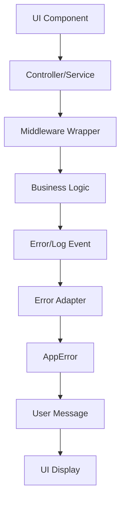

# 20minCoach — Frontend Architecture & Prototype

> **Case #1, 30%**  
> Group Project — 3 members 
> Jose David Chaves Mena, <no olvidar nombre>, <no olvidar nombre> 

---
### Project Overview

**20minCoach** is a real-time coaching platform that connects users with experts across multiple fields (health, psychology, law, mechanics, programming, arts, agriculture, and more) through on-demand **20-minute video sessions**.  

Users can:  
- Describe their needs (via text or voice).  
- Search and filter available coaches by specialty, tags, or ratings.  
- Instantly connect with a coach once availability is confirmed.  

Coaches can:  
- Manage their profiles and availability.  
- Accept or reject coaching requests.  
- Build reputation through ratings, directly influencing their earnings.  

**Business model:** Prepaid session packages (Starter, Pro, etc.), launched initially in **Colombia** and **Brazil**.

---
### Technologies Used
- React Native with Expo
- TypeScript
- Redux Toolkit for state management
- React Navigation for routing
- Jest for testing
- Supabase for authentification

---
## Repository Structure

```bash
repo-root/
│── README.md                 # This documentation
│── docs/                     # Documentation files & diagrams
│   ├── diagrams/             # Architecture & UML diagrams
│   ├── Testing Guide.md      # Complete testing documentation
│   └── ...
│── src/                      # Source code (PoCs + architecture implementation)
│   ├── App.tsx               # App bootstrap
│   ├── pocs/                 # PRUEBAS DE CONCEPTO FUNCIONALES !!!!!!!!~
│   │   ├── video-call/
│   │   ├── auth-roles/
│   │   ├── real-time-search/
│   │   └── notifications/
│   ├── components/           # Visual components
│   │   ├── auth/
│   │   ├── common/           # Atoms, Molecules, Organisms
│   │   │   ├── atoms/        # Componentes básicos
│   │   │   ├── molecules/    # Componentes compuestos
│   │   │   └── organisms/    # Componentes complejos
│   │   └── styles/
│   ├── controllers/          # Controllers (Auth, Search, etc.)
│   ├── models/               # Models (User, Coach, etc.)
│   ├── screens/              # Screens (Login, Search, Results, Profile)
│   ├── slices/               # Redux slices
│   ├── state/                # Store config
│   ├── api/                  # Proxy/Client layer [TODO]
│   ├── business/             # Business logic services [TODO]
│   ├── middleware/           # Middlewares (logging, validation, error handler)
│   ├── validators/           # Validation rules [TODO]
│   ├── utils/                # Helpers (logger, formatters, singletons)
│   └── tests/                # Unit tests (fixtures, mocks, utils)
├── App.tsx     
│── package.json
│── tsconfig.json
│── .gitignore
└── ...
```

---
## Getting Started

### Prerequisites
- Node.js >= 16.x  
- Expo CLI  
- iOS Simulator / Android Emulator or Expo App on cellphone

### Installation & Running the app
```bash
git clone <REPO_URL>
cd frontend-architecture-project-20minCoach
npm install
npm start # Run the app
```

### Demo Accounts
- **User** → `user@example.com / password123`  TODO: !!!!!!!!!!!!!!!!!!!!!!!!!!!!

---

## Testing

### 🧪 Testing Strategy
- **Framework**: Jest 29.7.0 + React Native Testing Library
- **Cobertura**: 80% líneas, 90% funciones, 75% ramas
- **Tests implementados**: 52 tests unitarios pasando
- **Documentación completa**: Ver [Testing Guide](docs/Testing%20Guide.md)

### 🏃 Running Tests
```bash
cd src
npm test                 # Run all tests
npm run test:watch       # Watch mode
npm run test:coverage    # Coverage report
npm run test:models      # Only model tests
npm run test:controllers # Only controllers
```

### 📊 Test Coverage
- **UserModel**: 6 tests (roles, validaciones, acceso premium)
- **CoachModel**: 15 tests (constructor, búsqueda, especialización)
- **AuthController**: 8 tests (login, validaciones, roles)
- **SearchController**: 23 tests (búsqueda, filtros, validaciones)

### 📂 Test Structure
```bash
src/tests/
├── fixtures/        # Test data
├── mocks/           # Reusable mocks
├── utils/           # Helpers
├── user.test.ts     # UserModel tests
├── coach.test.ts    # CoachModel tests
├── authController.test.ts    # AuthController tests
├── searchController.test.ts  # SearchController tests
└── setup.ts         # Jest config
```

**📖 Para más detalles, consulta la [Guía Completa de Testing](docs/Testing%20Guide.md)**

---

## UX & Security Proof of Concepts

### 1. Prototype Screen
- AI tool used: Vercel's `v0` [https://v0.app/]
- Prototype created for: **Search Screen + Coach Results**.  
- Stored under: `src/screens`  

### 2. UX Testing
- Tool: `Maze`  
- Tasks:  
  1. Search for a coach specialized in `<PLACEHOLDER: Fitness>`.    TODO: !!!!!!!!!!!!!!!!!!!!!!!!!!!!
  2. Accept suggested coach.   TODO: !!!!!!!!!!!!!!!!!!!!!!!!!!!!
- Participants: 3–5 testers 
- Results stored in: `/docs/ux-tests/`  

### 3. Authentication & Authorization  TODO: !!!!!!!!!!!!!!!!!!!!!!!!!!!!
- Provider: `Supabase`  
- Roles:  
  - `BasicUser` → Action A only.  
  - `PremiumUser` → Action A + Action B.  
- Two-Factor Authentication enabled.  
- Login screen integrated (`LoginScreen.tsx`).  

---

## Frontend Architecture Design 

### 1. Technology Selection  TODO: !!!!!!!!!!!!!!!!!!!!!!!!!!!!
- Framework: **React Native with Expo**  
- State Management: **Redux Toolkit**  
- Testing: **Jest + React Native Testing Library**   

See `/docs/Technology-Selection.md` for full justification.  TODO: !!!!!!!!!!!!!!!!!!!!!!!!!!!!

---

### 2. N-Layer Architecture  TODO: !!!!!!!!!!!!!!!!!!!!!!!!!!!!

**Layers included:**  
- **Presentation Layer** → `components/`, `screens/`  
- **Controllers Layer** → `controllers/`  
- **Model Layer** → `models/`  
- **Middleware Layer** → `middleware/`  
- **Business Layer** → `business/`  
- **Proxy/Client Layer** → `api/`  
- **State Management Layer** → `slices/`, `state/`  
- **Validators & DTOs** → `validators/`, `dto/`  
- **Utilities** → `utils/`  
- **Security** → Integrated auth provider  

Diagrams stored in `/docs/diagrams/`.

---

### 3. Detailed Layer Design Requirements

Each of these subsections must describe **responsibilities, examples, templates, and outputs** for developers:

- **Visual Components** — hierarchy (atoms/molecules/organisms), accessibility rules, responsive design examples.  
- **Controllers** — mediation logic, hooks integration, validation handling.  
- **Models** — domain objects (`User`, `Coach`), validators, usage examples.  
- **Middleware** — interceptors, error handling, logging.  
- **Business Logic** — reusable services, domain rules.  
- **Proxy/Client** — API abstraction (`api/client.ts`).  
- **Background/Listeners** — WebSocket listeners, periodic refreshers.  
- **Validators** — `validators/validator.ts`, templates.  
- **DTOs** — mapping between API and frontend models.  
- **State Management** — Redux slices + store.  
- **Styles** — responsive rules, dark/light mode strategy.  
- **Utilities** — helpers, singletons.  
- **Exception Handling** — friendly error handling + logging.  
- **Logging** — strategy-pattern logger with pluggable providers.  
- **Security** — auth integration with roles.

---

## 4. Middleware Layer - Error Handling & Logging

### 4.1 Flow and General Purpose

The middleware acts as an interception layer that allows keeping business logic clean and focused. Its main purpose is:

- **Intercept** errors and convert them to a standardized format
- **Log** events and errors consistently
- **Provide** user-friendly messages
- **Keep** business logic free from cross-cutting concerns



### 4.2 Middleware System Architecture

#### Directory Structure
```
src/middleware/
├── types/
│   └── AppError.ts              # Master error class
├── adapters/
│   └── ErrorAdapter.ts          # Adapter for error conversion
├── logging/
│   └── LoggingStrategy.ts       # Logging system with Strategy pattern
├── wrappers/
│   └── MiddlewareWrappers.ts    # Reusable wrappers
├── clients/
│   ├── HttpClient.ts            # Resilient HTTP client
│   ├── WebSocketClient.ts       # WebSocket client with reconnection
│   └── WebRTCClient.ts          # WebRTC client for video calls
├── examples/
│   ├── ExceptionHandlingExamples.ts  # Usage examples
│   └── ErrorBoundaryExample.tsx      # Error Boundary for React
└── index.ts                     # Main entry point
```

### 4.3 Main Components

#### 4.3.1 Master AppError Class

**Responsibility**: Centralize all application errors in a standard format.

```typescript
import { AppError, ERROR_CODES } from '@/middleware';

// Create an error
const error = new AppError(
  ERROR_CODES.AUTH_FAILED,
  'Login credentials invalid',
  { component: 'AuthController', userId: '123' }
);

// Get user-friendly message
const userMessage = error.getMessage(); // "Incorrect email or password."

// Get technical information for logging
const techInfo = error.getTechnicalInfo();
```

**Predefined Error Codes**:
- `NETWORK_TIMEOUT`, `NETWORK_ERROR`
- `HTTP_400`, `HTTP_401`, `HTTP_403`, `HTTP_404`, `HTTP_500`
- `VALIDATION_ERROR`, `EMAIL_INVALID`, `PASSWORD_WEAK`
- `AUTH_FAILED`, `AUTH_TOKEN_EXPIRED`, `AUTH_PERMISSION_DENIED`
- `WS_DISCONNECTED`, `WS_RECONNECT_FAILED`
- `RTC_DEVICE`, `RTC_PERMISSION_DENIED`, `RTC_DEVICE_UNAVAILABLE`

#### 4.3.2 Error Adapter

**Responsibility**: Convert any error to AppError and generate user-friendly messages.

```typescript
import { ErrorAdapter } from '@/middleware';

// Convert raw error to AppError
const appError = ErrorAdapter.toAppError(error, { component: 'MyComponent' });

// Get user-friendly message
const userMessage = ErrorAdapter.toUserMessage(appError);

// Convert specific errors
const supabaseError = ErrorAdapter.fromSupabaseError(supabaseError);
const httpError = ErrorAdapter.fromHttpError(response);
```

#### 4.3.3 Logging System (Strategy Pattern)

**Responsibility**: Log events consistently with multiple providers.

```typescript
import { logger, SupabaseLoggingProvider } from '@/middleware';

// Configure providers
logger.addProvider(new SupabaseLoggingProvider(supabaseClient));

// Log events
logger.info('User logged in', { userId: '123' }, 'AuthController');
logger.error('Login failed', { error: 'Invalid credentials' }, 'AuthController');
logger.warn('API response slow', { duration: 5000 }, 'ApiClient');
```

**Available Providers**:
- `ConsoleLoggingProvider` - Basic console logging
- `SupabaseLoggingProvider` - Structured logging in Supabase
- `SentryLoggingProvider` - Error tracking with Sentry

### 4.4 Middleware Wrappers

#### 4.4.1 Basic Wrappers

**withAppError**: Captures errors and converts them to AppError
```typescript
import { withAppError } from '@/middleware';

const safeFunction = withAppError(myFunction, { component: 'MyComponent' });
```

**withLogging**: Logs operation duration and status
```typescript
import { withLogging } from '@/middleware';

const loggedFunction = withLogging(myFunction, { component: 'MyComponent' });
```

**withMiddleware**: Combines both wrappers
```typescript
import { withMiddleware } from '@/middleware';

const wrappedFunction = withMiddleware(myFunction, { component: 'MyComponent' });
```

#### 4.4.2 Specialized Wrappers

**withPermissionCheck**: Validates permissions before executing
```typescript
import { withPermissionCheck } from '@/middleware';

const protectedFunction = withPermissionCheck(
  myFunction, 
  'COACH_BOOKING',
  { component: 'BookingService' }
);
```

**withAuthentication**: Verifies authentication
```typescript
import { withAuthentication } from '@/middleware';

const authenticatedFunction = withAuthentication(myFunction, { component: 'MyComponent' });
```

**withRetry**: Implements automatic retries
```typescript
import { withRetry } from '@/middleware';

const resilientFunction = withRetry(myFunction, 3, 1000, { component: 'MyComponent' });
```

### 4.5 Resilient Clients

#### 4.5.1 HttpClient

**Features**:
- Automatic retry with exponential backoff
- Circuit breaker to prevent saturation
- Robust timeout handling
- Automatic authentication headers

```typescript
import { httpClient } from '@/middleware';

// Set authentication token
httpClient.setAuthToken('bearer-token');

// Make requests
const coaches = await httpClient.get('/api/coaches');
const newCoach = await httpClient.post('/api/coaches', coachData);
```

#### 4.5.2 WebSocketClient

**Features**:
- Automatic reconnection with exponential backoff
- Heartbeat to keep connection alive
- Connection state handling
- Typed event handlers

```typescript
import { WebSocketClient } from '@/middleware';

const wsClient = new WebSocketClient({
  url: 'wss://api.20mincoach.com/ws',
  reconnectAttempts: 5,
  reconnectDelay: 1000
});

wsClient.onMessage('coach_available', (message) => {
  console.log('Coach available:', message.data);
});

await wsClient.connect();
```

#### 4.5.3 WebRTCClient

**Features**:
- Device permission handling
- Automatic device switching
- Configurable connection timeouts
- Event handlers for connection states

```typescript
import { WebRTCClient } from '@/middleware';

const rtcClient = new WebRTCClient({
  iceServers: [{ urls: 'stun:stun.l.google.com:19302' }]
});

await rtcClient.initialize();
const stream = await rtcClient.requestMediaAccess();
```

### 4.6 Usage Patterns

#### 4.6.1 Form A: Direct Error Handling

**When to use**: Complex business logic that requires granular control.

```typescript
// In a controller
export class AuthController {
  static async loginUser(email: string, password: string): Promise<any> {
    const context = { component: 'AuthController', action: 'loginUser' };
    
    try {
      const response = await httpClient.post('/api/auth/login', { email, password });
      return response.user;
    } catch (error) {
      const appError = ErrorAdapter.toAppError(error, context);
      logger.error('Login failed', { error: appError.getTechnicalInfo() });
      throw appError;
    }
  }
}

// In a component
const handleLogin = async () => {
  try {
    const user = await AuthController.loginUser(email, password);
    // Navigate to next screen
  } catch (error) {
    const appError = ErrorAdapter.toAppError(error);
    const userMessage = ErrorAdapter.toUserMessage(appError);
    Alert.alert('Error', userMessage);
  }
};
```

#### 4.6.2 Form B: Middleware Wrappers

**When to use**: CRUD operations and standard API calls.

```typescript
// Base function (clean)
private static async _searchCoaches(query: string): Promise<Coach[]> {
  const response = await httpClient.get(`/api/coaches/search?q=${query}`);
  return response.coaches;
}

// Wrapped function (automatic handling)
static searchCoaches = withMiddleware(
  CoachService._searchCoaches,
  { component: 'CoachService', action: 'searchCoaches' }
);

// Usage in component
const searchCoaches = async () => {
  try {
    const coaches = await CoachService.searchCoaches(query);
    setCoaches(coaches);
  } catch (error) {
    // Error is already converted and logged automatically
    const userMessage = ErrorAdapter.toUserMessage(error as AppError);
    showToast(userMessage);
  }
};
```

### 4.7 Error Boundary for React

**Responsibility**: Capture rendering errors and show user-friendly error UI.

```typescript
import { ErrorBoundary } from '@/middleware';

function App() {
  return (
    <ErrorBoundary
      onError={(error, errorInfo) => {
        // Send to monitoring service
        logger.error('React error boundary', { error: error.getTechnicalInfo() });
      }}
    >
      <MyApp />
    </ErrorBoundary>
  );
}
```

### 4.8 Developer Guide

#### 4.8.1 Golden Rules

1. **Never allow "raw" errors** from libraries to propagate
2. **Always convert** errors to AppError using ErrorAdapter
3. **UI never decides** error texts, only requests the message
4. **Always log** errors using the logging system
5. **Use middleware wrappers** for standard operations

#### 4.8.2 Workflow

1. **Identify** the layer where the error occurs
2. **Determine** whether to use direct handling or middleware wrapper
3. **Convert** the error to AppError
4. **Log** the error with appropriate context
5. **Show** user-friendly message

#### 4.8.3 Integration Examples

**In Controllers**:
```typescript
export const useSearchCoachesController = () => {
  const [uiError, setUiError] = useState<string | null>(null);
  
  const searchCoaches = async (query: string) => {
    try {
      setUiError(null);
      const coaches = await CoachService.searchCoaches(query);
      return coaches;
    } catch (error) {
      const appError = ErrorAdapter.toAppError(error);
      const userMessage = ErrorAdapter.toUserMessage(appError);
      setUiError(userMessage);
      throw appError;
    }
  };
  
  return { searchCoaches, uiError };
};
```

**In Screens**:
```typescript
export function CoachSearchScreen() {
  const { searchCoaches, uiError } = useSearchCoachesController();
  
  return (
    <View>
      <SearchBar onSearch={searchCoaches} />
      {uiError && <Text style={styles.errorText}>{uiError}</Text>}
    </View>
  );
}
```

### 4.9 Testing

**Requirements**: Unit tests for key middleware system components.

```typescript
// Tests for ErrorAdapter
describe('ErrorAdapter', () => {
  it('should convert generic error to AppError', () => {
    const error = new Error('Test error');
    const appError = ErrorAdapter.toAppError(error);
    expect(appError).toBeInstanceOf(AppError);
    expect(appError.code).toBe('UNKNOWN_ERROR');
  });
  
  it('should generate user-friendly messages', () => {
    const appError = new AppError('AUTH_FAILED', 'Auth failed');
    const userMessage = ErrorAdapter.toUserMessage(appError);
    expect(userMessage).toBe('Email o contraseña incorrectos.');
  });
});

// Tests for HttpClient
describe('HttpClient', () => {
  it('should handle network errors gracefully', async () => {
    // Mock fetch to throw network error
    global.fetch = jest.fn().mockRejectedValue(new Error('Network error'));
    
    await expect(httpClient.get('/test')).rejects.toThrow(AppError);
  });
});
```  

---

## Required Diagrams  TODO: !!!!!!!!!!!!!!!!!!!!!!!!!!!!

All diagrams are stored in `/docs/diagrams/` and exported as **PDF** and editable source files:

1. **N-Layer Architecture Diagram**   TODO: !!!!!!!!!!!!!!!!!!!!!!!!!!!!
2. **Class Diagram (UML)**   TODO: !!!!!!!!!!!!!!!!!!!!!!!!!!!!

---

## Linter configuration

This project uses [ESLint](https://eslint.org/) as the linting tool to ensure clean, consistent, and error-free code. ESLint is configured with support for TypeScript, React, React Hooks, and Prettier integration for formatting. Also other pluggins used are:
- `@typescript-eslint/eslint-plugin` — TypeScript support.
- `eslint-plugin-react` — React-specific rules.
- `eslint-plugin-react-hooks` — Rules for hooks best practices.
- `eslint-plugin-prettier` — Enforces Prettier formatting rules. 

### Rules/conventions

#### Base JavaScript Rules (from `@eslint/js`)

Standard best practices for JavaScript, including:
- Disallow unused variables
- Disallow unreachable code
- Warn about confusing arrow functions or misuse of == vs ===
- Enforce curly braces for blocks
- Encourage === over ==

#### TypeScript Rules (from `@typescript-eslint`)

- `@typescript-eslint/no-unused-vars`: Disallow unused variables (Error)
- `@typescript-eslint/no-explicit-any`: Discourages using any type (Warning)
- Enforces strict typing and clean, maintainable TypeScript code
- Checks function return types, parameter consistency, and type safety

#### React Rules (from `eslint-plugin-react`)

- Enforces best practices in React components
- Validates JSX syntax
- Warns if component props aren’t used properly
- Helps avoid unnecessary re-renders or unsafe lifecycle methods

#### Prettier Formatting Rules (from `eslint-plugin-prettier`)

- All code must follow Prettier formatting
- Any formatting issues (indentation, spacing, quotes, etc.) are treated as errors
- Helps keep consistent code style across the entire team

#### Custom Rules
- `no-console`: Warn when using console.log
- `prefer-const`: Prefer const over let if possible
- `no-var`: Disallow use of var

### Running ESLint
```bash
npm run lint # to check your code
npm run lint --fix # to automatically fix problems
```

## Deliverables Checklist  TODO: !!!!!!!!!!!!!!!!!!!!!!!!!!!!

1. DIAGRAMAS FALTANTES
  - [ ] Architecture-diagram.pdf - Diagrama N-Layer claro
  - [ ] Class-diagram.pdf - Con patrones de diseño etiquetados
  - [ ] Component-hierarchy.pdf - Estructura de componentes React

2. PRUEBAS DE CONCEPTO (PoCs) REALES
  - [ ] PoC #1: Video llamada funcional (20min timer incluido)
  - [ ] PoC #2: Sistema de roles funcionando (BasicUser/PremiumUser)
  - [ ] PoC #3: Búsqueda en tiempo real con filtros
  - [ ] PoC #4: Notificaciones en tiempo real

3. AUTENTICACIÓN
  - [ ] Auth0/Clerk configurado con 2 roles
  - [ ] BasicUser: Solo puede buscar coaches
  - [ ] PremiumUser: Puede buscar + reservar instantáneamente
  - [ ] MFA (Two Factor) funcionando
  - [ ] Middleware de permisos implementado

4. TESTING
  - [ ] 3 UNIT TESTS para AuthController (deben pasar)
  - [ ] 3 UNIT TESTS para Coach model (deben pasar)
  - [ ] Tests ejecutándose en pipeline
  - [ ] Scripts: npm test → funciona

5. UX/UI
  - [ ] Test con Maze/Useberry (5 participantes reales)
  - [ ] Evidencia: screenshots de resultados

6. ARQUITECTURA IMPLEMENTADA
  - [ ] Capa Middleware: error handling, logging, auth
  - [ ] Capa Business: lógica de negocio real
  - [ ] Capa Services: API clients funcionales
  - [ ] Capa Utils: loggers, validators

LO QUE EL PROFESOR VA A REVISAR ESPECÍFICAMENTE
[ ] 1. ¿Puedo clonar el repo y ejecutar `npm test` sin errores?
[ ] 2. ¿Los 6 tests unitarios PASAN?
[ ] 3. ¿Puedo hacer login como BasicUser y PremiumUser?
[ ] 4. ¿Veo diferentes funcionalidades según mi rol?
[ ] 5. ¿El diagrama de arquitectura es claro y profesional?
[ ] 6. ¿Hay evidencia de testing UX con personas reales?
[ ] 7. ¿Puedo entender TODO con solo leer el README.md?

---

## Timeline

- **Last commit date:** Saturday, September 27  
- **Participation requirement:** Every group member must contribute commits weekly.  

---

## License
This repository is for **educational and prototype purposes only**.  
