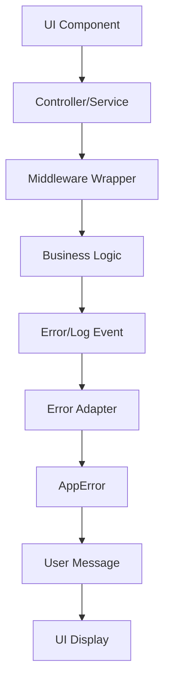
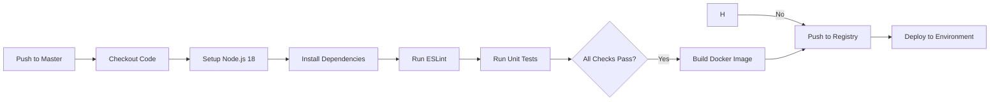

# 20minCoach — Frontend Architecture & Prototype

> **Case #1, 25%**  
> Group Project — 3 members 
> Jose David Chaves Mena, Sebastián Chacón Muñoz, Marlon Badilla Mora

---
### Project Overview

**20minCoach** is a real-time coaching platform that connects users with experts across multiple fields (health, psychology, law, mechanics, programming, arts, agriculture, and more) through on-demand **20-minute video sessions**.  

Users can:  
- Describe their needs (via text or voice).  
- Search and filter available coaches by specialty, tags, or ratings.  
- Instantly connect with a coach once availability is confirmed.  

Coaches can:  
- Manage their profiles and availability.  
- Accept or reject coaching requests.  
- Build reputation through ratings, directly influencing their earnings.  

**Business model:** Prepaid session packages (Starter, Pro, etc.), launched initially in **Colombia** and **Brazil**.

---
### Technologies Used
- React Native with Expo
- TypeScript
- Redux Toolkit for state management
- React Navigation for routing
- Jest for testing
- Supabase for authentification

---
## Repository Structure

```bash
repo-root/
│
├── app.json                          # Expo app configuration
├── App.tsx                           # Root application component 
├── assets/                           # Static assets management
│   └── public/                       # Background images and professional profile pictures
├── docs/                             # Comprehensive documentation
│   ├── ScriptForAi.txt               # AI prompt templates and guidelines
│   ├── Testing Guide.md              # Testing strategies and procedures
│   └── ux-tests/                     # User experience test reports
├── github/                           # CI/CD and deployment configuration
│   └── workflows/                    # GitHub Actions build/test/deploy pipeline
├── src/                              # CORE SOURCE CODE
│   │
│   ├── clients/                      # External service clients
│   │   ├── HttpClient.ts             # Example of REST API client
│   │   ├── WebRTCClient.ts           # Mock Video call WebRTC implementation
│   │   └── WebSocketClient.ts        # Mock Real-time communication client
│   │
│   ├── components/                   # REUSABLE UI COMPONENTS (Atomic Design)
│   │   ├── auth/                     # Authentication-specific components
│   │   │   ├── Account.tsx           # User account management component
│   │   │   └── Auth.tsx              # Main authentication flow component
│   │   │
│   │   ├── common/                   # Atomic design system implementation
│   │   │   ├── atoms/                # Fundamental building blocks
│   │   │   ├── molecules/            # Combinations of atoms
│   │   │   └── organisms/            # Complex composite components
│   │   └── styles/                   # STYLING SYSTEM & THEMING
│   │       ├── GlobalStyles.tsx      # Global style constants and mixins
│   │       ├── ThemeContext.tsx      # Light/dark theme context provider
│   │       ├── atoms/                # Component-specific style files
│   │       ├── molecules/            # Molecular component styles
│   │       └── organisms/            # Organism component styles
│   │
│   ├── controllers/                  # LOGIC CONTROLLERS
│   │   ├── authController.ts         # Authentication business logic
│   │   └── searchController.ts       # Search and filtering logic
│   │
│   ├── middleware/                   # MIDDLEWARE 
│   │   ├── adapters/                 # External service adapters
│   │   ├── logging/                  # Application logging
│   │   ├── types/                    # Type definitions
│   │   ├── wrappers/                 # Function wrappers
│   │   └── examples/                 # Implementation examples
│   │
│   ├── models/                       # DATA MODELS & TYPES
│   │
│   ├── pocs/                         # PROOF OF CONCEPT PROTOTYPES
│   │   ├── real-time-search/         # Real-time search implementation
│   │   ├── video-call/               # Video call feature exploration
│   │   └── notifications/            # Push notification system POC
│   │
│   ├── screens/                      # APPLICATION SCREENS
│   ├── slices/                       # REDUX SLICES
│   │   ├── authSlice.ts              # Authentication state management
│   │   └── coachesSlice.ts           # Coaches data and search state
│   │
│   ├── state/                        # STATE MANAGEMENT 
│   ├── tests/                        # TESTING
│   └── utils/                        # UTILITIES
├── package.json                      # NPM dependencies and scripts
├── tsconfig.json                     # TypeScript compiler configuration
├── babel.config.js                   # Babel transpiler configuration
├── metro.config.js                   # Metro bundler configuration
├── jest.config.js                    # Jest testing framework setup
├── eslint.config.js                  # ESLint code quality rules
└── README.md                         # Project documentation and setup
```

---
## Getting Started

### Prerequisites
- Node.js >= 16.x  
- Expo CLI  
- iOS Simulator / Android Emulator or Expo App on cellphone

### Installation & Running the app
```bash
git clone <REPO_URL>
cd frontend-architecture-project-20minCoach
npm install
npm start # Run the app
```

---

# Proof of concepts to develop

## Testing Strategy

###  Run Tests
```bash
# From the project root
npm test                 #  Run all tests
npm run test:watch       #  Watch mode (automatic)
npm run test:coverage    #  Coverage report
npm run test:ci          #  For CI/CD
npm run test:models      #  Only model tests
npm run test:controllers #  Only controller tests
```

###  Test Coverage
| Component | Tests | Status | Description |
|-----------|-------|--------|-------------|
| **UserModel** | 4 tests |  PASS | Validations, roles, premium access |
| **CoachModel** | 17 tests |  PASS | Constructor, search, specialization, tags |
| **SearchController** | 22 tests |  PASS | Search, filters, text validations |
| **AuthController** | 5 tests |  PASS | Login, validations, roles |
| **TOTAL** | **47 tests** | ** ALL PASS** | **0 tests failing** |

###  Test Structure
```bash
src/tests/
├── setup.ts                    #  Global Jest configuration
├── fixtures/                   #  Reusable test data
├── mocks/                      #  External API mocks
├── utils/                      #  Test utilities
├── user.test.ts               #  4 tests - UserModel
├── coach.test.ts              #  17 tests - CoachModel
├── authController.test.ts     #  5 tests - AuthController
└── searchController.test.ts   #  22 tests - SearchController
```

###  Technical Configuration
- **Jest Config**: `jest.config.js` - Complete configuration
- **Setup**: `src/tests/setup.ts` - React Native mocks
- **TypeScript**: Complete support with types
- **Coverage**: HTML, LCOV, JSON reports

###  Debug Commands
```bash
npx jest --verbose              # Detailed output
npx jest --detectOpenHandles   # Detect open handles
npx jest --clearCache          # Clear cache
npx jest user.test.ts          # Specific test
```

###  Quick Verification
```bash
# Verify everything works
npm test

# Expected result:
#  Test Suites: 4 passed, 4 total
#  Tests:       47 passed, 47 total
#  Snapshots:   0 total
#  Time:        ~7.5s
```
** Complete documentation, tips and Best Practices: **: [Testing Guide](docs/Testing_20Guide.md)

---

## UX & Security

### 1. Prototype screen & UX testing
- AI tool used: Vercel's [v0](https://v0.app/)
- Prototype created for: **Search Screen + Coach Results**.  
- Stored under: `src/screens`  

### 2. UX Testing
- Tool: [Maze](https://maze.co/)  
- Tasks:  
  1. Search for a specific coach
  2. Booking a Session
- Participants: 4 testers 
- Test link: [UX Testing 20min Coach](https://t.maze.co/447054949)
- Results stored in: `/docs/ux-tests/`  

### 3. Authentication & Authorization

#### Authentication Provider
- Provider: `Supabase Auth`
- Two-Factor Authentication enabled via SMS/Email
- Built-in login screen with email/password (`Auth.tsx`)
- Session management with auto-refresh

#### Role-Based Access Control
- **Roles & Permissions**:
  - BasicUser:
    - Can search and view coaches
    - Can book free consultation sessions
  - PremiumUser: 
    - All BasicUser permissions
    - Can book paid coaching sessions
    - Access to premium coaches

#### Implementation Details
- Role configuration in Supabase Management Console
- Server-side permission validation via Row Level Security (RLS)
- Client-side UI rendering based on user role
- Protected routes with role-based guards

#### Account Creation
- Sign up with your email at `Auth.tsx` login screen
- Check your email for verification link
- After verification, you can access the platform with:
  - Basic features by default
  - Premium features by upgrading your account
- 2FA options available:
  - SMS verification
  - Authenticator app

#### Integration
- Login screen (`src/components/auth/Auth.tsx`)
- Role-based routing (`src/navigation/ProtectedRoute.tsx`)
- Permission hooks (`src/hooks/usePermissions.ts`)

---


## 1. Visual Components

### Visual component architecture
This project follows an atomic design architecture, structured into three levels of UI components:

```bash
src/components/
├── common/
│   ├── atoms/        # Basic, reusable UI elements (Button, Input, etc.)
│   ├── molecules/    # Groupings of atoms (SearchBar, ProfileHeader, etc.)
│   └── organisms/    # Larger composites (CoachCard, FilterPanel, etc.)
├── auth/             # Screens and flows related to authentication
└── styles/           # Modularized style files for each component
```
Each component has a corresponding .styles.ts file located in the styles/ directory under its appropriate level (atoms, molecules, organisms).

### Reusability & scalability

All UI components are:
- 1. Reusably designed with props for flexibility.
- 2. Separated into visual `(*.tsx)` and styling `(*.styles.ts)` layers.
- 3. Easily themable via a central `ThemeContext`.

Example: `Button.tsx` receives props like disabled, with all visuals defined in `Button.styles.ts.`
 
 ``` tsx
 // src/components/common/atoms/Button.tsx
 interface ButtonProps {
  title: string;
  onPress: () => void;
  variant?: "primary" | "secondary" | "outline" | "ghost";
  size?: "small" | "medium" | "large";
  disabled?: boolean;
  style?: ViewStyle;
  textStyle?: TextStyle;
}
```

``` ts
// src/components/styles/atoms/Button.styles.tsx
export const createButtonStyles = (theme: ThemeContextType, disabled = false) =>
  StyleSheet.create({
    baseStyle: {
      borderRadius: 8,
      alignItems: "center",
      justifyContent: "center",
      flexDirection: "row",
    },
    // ...
    ghostTextStyles: {
      color: disabled ? theme.colors.textSecondary : theme.colors.primary,
  },
});
 ```

### Responsive design guidelines

Responsiveness is managed via:
- **Flexbox** layouts for dynamic resizing.
- **StyleSheet** composition for base, responsive, and conditional styles.
- Shared layout patterns in `GlobalStyles.tsx`.

---

## 2. Styles/theme strategy

Dark and light themes are implemented via:
- A global [ThemeContext](src/components/styles/ThemeContext.tsx). This helps to centralized theme values.
- All styles reference the active theme from context.

**How it Works**

A `ThemeProvider` wraps the application and manages theme state.
The theme preference (light, dark, or system) is stored persistently using `AsyncStorage`. Theme colors are defined in a consistent shape via a `ThemeColors` interface for strong typing and reusability.

Each theme (light and dark) defines values for:
```tsx
interface ThemeColors {
  background: string;
  surface: string;
  primary: string;
  secondary: string;
  accent: string;
  text: string;
  textSecondary: string;
  border: string;
  card: string;
  error: string;
  success: string;
  warning: string;
}
```

Example
```tsx
import { useTheme } from '../styles/ThemeContext';

const MyComponent = () => {
  const { colors } = useTheme();

  return (
    <View style={{ backgroundColor: colors.background }}>
      <Text style={{ color: colors.text }}>Hello Theme!</Text>
    </View>
  );
};
```

### Styling strategy

|**Principle**	| **Pecommended practice**	| 
| --- | --- |
|Modular styles	| One style file per component (`*.styles.ts`)	| 
|Theme support	| Central `ThemeContext` with light/dark toggling	| 
|Responsive rules	| Flexbox layout, % widths 	| 
|Layout styles	| Stored in `GlobalStyles.tsx`	| 

All style files use `StyleSheet.create()` to enable React Native optimization.

### Developer instructions

These rules must be followed by the development team when contributing in the UI:
- When creating a new reusable component, select the appropriate level (atom, molecule, or organism).
- Create a new style file when building a new component (e.g. `NewButton.styles.ts`) in the corresponding level folder.
- Use the theme context to apply colors, spacing, and font sizes (recommended to maintain consistency with the app’s overall design).
- Avoid hardcoding styles directly in `.tsx` files; place all styles in a corresponding `*.styles.ts` file. (Only very specific or unlikely-to-change details can be exceptions.)
- Ensure mobile responsiveness using flex, percentages (%), Dimensions, etc.
- Test both light and dark modes before submitting changes.

---

## 3. Linter configuration

This project uses [ESLint](https://eslint.org/) as the linting tool to ensure clean, consistent, and error-free code. ESLint is configured with support for TypeScript, React, React Hooks, and Prettier integration for formatting. Also other pluggins used are:
- `@typescript-eslint/eslint-plugin` — TypeScript support.
- `eslint-plugin-react` — React-specific rules.
- `eslint-plugin-react-hooks` — Rules for hooks best practices.
- `eslint-plugin-prettier` — Enforces Prettier formatting rules. 

### Rules/conventions

#### Base JavaScript Rules (from `@eslint/js`)

Standard best practices for JavaScript, including:
- Disallow unused variables
- Disallow unreachable code
- Warn about confusing arrow functions or misuse of == vs ===
- Enforce curly braces for blocks
- Encourage === over ==

#### TypeScript Rules (from `@typescript-eslint`)

- `@typescript-eslint/no-unused-vars`: Disallow unused variables (Error)
- `@typescript-eslint/no-explicit-any`: Discourages using any type (Warning)
- Enforces strict typing and clean, maintainable TypeScript code
- Checks function return types, parameter consistency, and type safety

#### React Rules (from `eslint-plugin-react`)

- Enforces best practices in React components
- Validates JSX syntax
- Warns if component props aren’t used properly
- Helps avoid unnecessary re-renders or unsafe lifecycle methods

#### Prettier Formatting Rules (from `eslint-plugin-prettier`)

- All code must follow Prettier formatting
- Any formatting issues (indentation, spacing, quotes, etc.) are treated as errors
- Helps keep consistent code style across the entire team

#### Custom Rules
- `no-console`: Warn when using console.log
- `prefer-const`: Prefer const over let if possible
- `no-var`: Disallow use of var

### Running ESLint
```bash
npm run lint # to check your code
npm run lint --fix # to automatically fix problems
```

---

## 3. Models and validators

Each model consists of:
- **Interface:** Defines the data structure and contract
- **Class:** Implements the interface and adds business logic + validation methods

**Example:**
```typescript
interface Coach {
  id: string;
  name: string;
  title: string;
  specialization: string[];
  rating: number;
  reviewCount: number;
  tags: string[];
  profilePicture: ImageSourcePropType;
  isAvailable: boolean;
  bio: string;
  experience: string;
  hourlyRate: number;
  coverPhoto?: ImageSourcePropType;
}

class CoachModel implements Coach {
  
  // Validation Methods
  validate(): ValidationResult
  
  // Business Logic Methods
  hasTag(tag: string): boolean
  matchesSpecialization(searchTerm: string): boolean
}
```
### For validation
We use **Joi** for comprehensive schema validation combined with custom rule validation.
THey go inside the `src/models/validators` folder to help keep both models and validators close.

**Example:**
```typescript
import Joi from 'joi';

export const CoachSchema = Joi.object({
  id: Joi.string().required().messages({
    'string.empty': 'Coach ID is required',
    'any.required': 'Coach ID is required'
  }),
  name: Joi.string().min(2).max(50).required().messages({
    'string.min': 'Name must be at least 2 characters',
    'string.max': 'Name cannot exceed 50 characters',
    'any.required': 'Name is required'
  }),
  // ...
  title: Joi.string().min(5).max(100).required(),
  });
```

```typescript
export class CoachModel implements Coach {
  // ... properties

  /**
   * Recommended Validates against Joi schema
   */
  validate(): { isValid: boolean; errors?: string[] } {
    const result = CoachSchema.validate(this, { 
      abortEarly: false, 
      allowUnknown: false 
    });
    if (result.error) {
      return {
        isValid: false,
        errors: result.error.details.map(detail => detail.message)
      };
    }
    return { isValid: true };
  }
}
```

### Create new Models/Validators

- 1. Create interface and class

```typescript
// 1. Define Interface
interface Thing {
  id: string;
  name: string;
}

// 2. Create Class with Validation
class thingModel implements Thing {
  id: string;
  name: string;

  constructor(data: Product) {
    this.id = data.id;
    this.name = data.name;
  }
}
```
- 2. Create Validator
```typescript
import Joi from 'joi';

// Simple validator schema
export const ProductSchema = Joi.object({
  id: Joi.string().required(),
  name: Joi.string().min(2).required(),
});

// Use in model
class thingModel implements Thing {
  // ... properties and methods
  
  validateWithJoi() {
    const result = ProductSchema.validate(this);
    return {
      isValid: !result.error,
      errors: result.error ? result.error.details.map(d => d.message) : []
    };
  }
}
```

- 3. Usage
```typescript
// Create instance
const product = new ProductModel({
  id: '1',
  name: 'Yoga Mat',
});

// Validate
const validation = product.validate();
if (!validation.isValid) {
  console.log('Errors:', validation.errors);
}
```
---

## 4. Clients

The HTTP Client (`HttpClient.ts`) provides an general way for a new API communications with built-in fault tolerance patterns including retries, circuit breakers, and comprehensive error handling.

### HttpClient 
It does:
- 1. **Circuit Breaker** - Blocks requests if API is broken
- 2. **Auto Retry** - Retries failed requests
- 3. **Timeout** - Stops requests after 30 seconds
- 4. **Error Standardization** - All errors look the same
- 5. **Common Methods** - get(), post(), put(), delete()

```typescript
class HttpClient {
  async request(url, config) {
    // 1. Check circuit breaker
    // 2. Make fetch request
    // 3. If error → circuit breaker counts failure
    // 4. If success → return data
  }
  
  // Shortcut methods
  get(url)    // GET request
  post(url, data)  // POST request  
  put(url, data)   // PUT request
  delete(url) // DELETE request
}
```

### Basic Usage

```typescript
// GET request
const coaches = await httpClient.get<Coach[]>('/coaches');

// POST request  
const newSession = await httpClient.post<Session>('/sessions', {
  coachId: '123',
  scheduledTime: '2024-01-01T10:00:00Z'
});

// With error context
const user = await httpClient.get<User>('/user/123', {}, {
  operation: 'fetchUser',
  userId: '123'
});
```

### Template for new API clients

```typescript
import { HttpClient } from "src/clients/HttpClient.ts";

// [resource].api.ts
class [Resource]Api {
  constructor(private http: HttpClient) {}

  // GET all
  async getAll(): Promise<[Resource][]> {
    return this.http.get<[Resource][]>('/[resource]');
  }

  // GET by ID
  async getById(id: string): Promise<[Resource]> {
    return this.http.get<[Resource]>(`/[resource]/${id}`);
  }

  // CREATE
  async create(data: Create[Resource]Request): Promise<[Resource]> {
    return this.http.post<[Resource]>('/[resource]', data);
  }

  // UPDATE
  async update(id: string, data: Partial<[Resource]>): Promise<[Resource]> {
    return this.http.put<[Resource]>(`/[resource]/${id}`, data);
  }

  // DELETE
  async delete(id: string): Promise<void> {
    return this.http.delete(`/[resource]/${id}`);
  }
}

export const [resource]Api = new [Resource]Api(httpClient);
```

---

## 5. Controllers

The controllers in this project implement the business logic and act as mediators between the user interface and the data services. The architecture follows separation-of-concerns principles and uses modern React patterns with hooks for connectivity.

### Controller Structure

There are 2 main controllers:

#### 1. **AuthController** (`src/controllers/authController.ts`)

- **Responsibility**: User authentication handling and credential validation
    
- **Key functions**:
    
    - `authenticateUser()`: Authenticates users with email and password
        
    - `validateEmail()`: Validates email format using regular expressions
        
- **Implementation**: Uses hard-coded data for simulation, with artificial delay to mimic API calls
    

#### 2. **SearchController** (`src/controllers/searchController.ts`)

- **Responsibility**: Search and filtering logic for coaches
    
- **Key functions**:
    
    - `searchCoaches()`: Filters coaches by query and tags
        
    - `getAvailableCoaches()`: Retrieves available coaches
        
    - `sortCoachesByRating()`: Sorts coaches by rating
        
    - `SearchController.validateProblemDescription()`: Validates problem descriptions (minimum 40 words)
        
    - `SearchController.filterCoaches()`: Advanced filtering with multiple criteria
        
    - `SearchController.getAvailableTags()`: Provides a complete list of available tags
        

### Hook-based Connectors

Controllers integrate with React components via custom hooks and Redux:

```typescript
// Example usage in LoginScreen.tsx
const dispatch = useDispatch();
const navigation = useNavigation();

const handleAuth = async () => {
  // Input validation using the controller
  if (!validateEmail(email)) {
    Alert.alert("Error", "Please enter a valid email address");
    return;
  }
  
  dispatch(loginStart());
  
  try {
    // Controller call
    const user = await authenticateUser(email, password);
    if (user) {
      dispatch(loginSuccess(user));
      // Role-based navigation
    }
  } catch (error) {
    dispatch(loginFailure());
  }
};
```

```typescript
// Example usage in UserHomeScreen.tsx
const { coaches } = useSelector((state: RootState) => state.coaches);
const dispatch = useDispatch();

const handleSearch = async () => {
  // Use the search controller
  const results = searchCoaches(coaches, searchQuery, selectedTags);
  dispatch(setSearchResults(results));
  navigation.navigate("CoachListing");
};
```

### Input Validation and Processing

Controllers implement robust validation of user data:

1. **Email Validation**: Regular expression for valid format
    
2. **Password Validation**: Minimum length check
    
3. **Description Validation**: Minimum 40 words for problem descriptions
    
4. **Data Filtering**: Availability checks and search criteria validation
    

### Dependency Injection

Although the project uses mocked data, the architecture is prepared for dependency injection:

- **HTTP Client**: Ready for integration with `HttpClient`
    
- **Middleware**: Implemented middleware system for error handling and logging
    
- **Adapters**: Adapter pattern implemented for error conversion
    
- **Services**: Structure prepared for external services (Supabase integrated)
    

### Middleware Integration

Controllers are designed to work with the middleware system:

```typescript
// Example of middleware integration (AuthIntegrationExample.tsx)
export class EnhancedAuthController {
  private static async _authenticateUser(email: string, password: string): Promise<any> {
    const context: ErrorContext = {
      component: 'EnhancedAuthController',
      action: '_authenticateUser',
      metadata: { email }
    };
    
    // Validation using existing controller
    if (!validateEmail(email)) {
      throw new AppError(ERROR_CODES.EMAIL_INVALID, 'Invalid email format', context);
    }
    
    // Use the original controller with improved error handling
    const user = await authenticateUser(email, password);
    return user;
  }
}
```

### Architectural Patterns

- **Separation of Concerns**: Controllers split by domain (auth, search)
    
- **Stateless Functions**: Pure functions with no internal state
    
- **Error Handling**: Centralized error handling with context
    
- **TypeScript**: Strong typing for better type safety
    
- **Testing Ready**: Structure prepared for unit testing

## 6. Middleware Layer 

### 4.1 Flow and General Purpose

The middleware acts as an interception layer that allows keeping business logic clean and focused. Its main purpose is:

- **Intercept** errors and convert them to a standardized format
- **Log** events and errors consistently
- **Provide** user-friendly messages
- **Keep** business logic free from cross-cutting concerns



### 4.2 Middleware System Architecture

#### Directory Structure
```
src/middleware/
├── types/
│   └── AppError.ts              # Master error class
├── adapters/
│   └── ErrorAdapter.ts          # Adapter for error conversion
├── logging/
│   └── LoggingStrategy.ts       # Logging system with Strategy pattern
├── wrappers/
│   └── MiddlewareWrappers.ts    # Reusable wrappers
├── clients/
│   ├── HttpClient.ts            # Resilient HTTP client
│   ├── WebSocketClient.ts       # WebSocket client with reconnection
│   └── WebRTCClient.ts          # WebRTC client for video calls
├── examples/
│   ├── ExceptionHandlingExamples.ts  # Usage examples
│   └── ErrorBoundaryExample.tsx      # Error Boundary for React
└── index.ts                     # Main entry point
```

### 4.3 Main Components

#### 4.3.1 Master AppError Class

**Responsibility**: Centralize all application errors in a standard format.

```typescript
import { AppError, ERROR_CODES } from '@/middleware';

// Create an error
const error = new AppError(
  ERROR_CODES.AUTH_FAILED,
  'Login credentials invalid',
  { component: 'AuthController', userId: '123' }
);

// Get user-friendly message
const userMessage = error.getMessage(); // "Incorrect email or password."

// Get technical information for logging
const techInfo = error.getTechnicalInfo();
```

**Predefined Error Codes**:
- `NETWORK_TIMEOUT`, `NETWORK_ERROR`
- `HTTP_400`, `HTTP_401`, `HTTP_403`, `HTTP_404`, `HTTP_500`
- `VALIDATION_ERROR`, `EMAIL_INVALID`, `PASSWORD_WEAK`
- `AUTH_FAILED`, `AUTH_TOKEN_EXPIRED`, `AUTH_PERMISSION_DENIED`
- `WS_DISCONNECTED`, `WS_RECONNECT_FAILED`
- `RTC_DEVICE`, `RTC_PERMISSION_DENIED`, `RTC_DEVICE_UNAVAILABLE`

#### 4.3.2 Error Adapter

**Responsibility**: Convert any error to AppError and generate user-friendly messages.

```typescript
import { ErrorAdapter } from '@/middleware';

// Convert raw error to AppError
const appError = ErrorAdapter.toAppError(error, { component: 'MyComponent' });

// Get user-friendly message
const userMessage = ErrorAdapter.toUserMessage(appError);

// Convert specific errors
const supabaseError = ErrorAdapter.fromSupabaseError(supabaseError);
const httpError = ErrorAdapter.fromHttpError(response);
```

#### 4.3.3 Logging System (Strategy Pattern)

**Responsibility**: Log events consistently with multiple providers.

```typescript
import { logger, SupabaseLoggingProvider } from '@/middleware';

// Configure providers
logger.addProvider(new SupabaseLoggingProvider(supabaseClient));

// Log events
logger.info('User logged in', { userId: '123' }, 'AuthController');
logger.error('Login failed', { error: 'Invalid credentials' }, 'AuthController');
logger.warn('API response slow', { duration: 5000 }, 'ApiClient');
```

**Available Providers**:
- `ConsoleLoggingProvider` - Basic console logging
- `SupabaseLoggingProvider` - Structured logging in Supabase
- `SentryLoggingProvider` - Error tracking with Sentry

### 4.4 Middleware Wrappers

#### 4.4.1 Basic Wrappers

**withAppError**: Captures errors and converts them to AppError
```typescript
import { withAppError } from '@/middleware';

const safeFunction = withAppError(myFunction, { component: 'MyComponent' });
```

**withLogging**: Logs operation duration and status
```typescript
import { withLogging } from '@/middleware';

const loggedFunction = withLogging(myFunction, { component: 'MyComponent' });
```

**withMiddleware**: Combines both wrappers
```typescript
import { withMiddleware } from '@/middleware';

const wrappedFunction = withMiddleware(myFunction, { component: 'MyComponent' });
```

#### 4.4.2 Specialized Wrappers

**withPermissionCheck**: Validates permissions before executing
```typescript
import { withPermissionCheck } from '@/middleware';

const protectedFunction = withPermissionCheck(
  myFunction, 
  'COACH_BOOKING',
  { component: 'BookingService' }
);
```

**withAuthentication**: Verifies authentication
```typescript
import { withAuthentication } from '@/middleware';

const authenticatedFunction = withAuthentication(myFunction, { component: 'MyComponent' });
```

**withRetry**: Implements automatic retries
```typescript
import { withRetry } from '@/middleware';

const resilientFunction = withRetry(myFunction, 3, 1000, { component: 'MyComponent' });
```

### 4.5 Resilient Clients

#### 4.5.1 HttpClient

**Features**:
- Automatic retry with exponential backoff
- Circuit breaker to prevent saturation
- Robust timeout handling
- Automatic authentication headers

```typescript
import { httpClient } from '@/middleware';

// Set authentication token
httpClient.setAuthToken('bearer-token');

// Make requests
const coaches = await httpClient.get('/api/coaches');
const newCoach = await httpClient.post('/api/coaches', coachData);
```

#### 4.5.2 WebSocketClient

**Features**:
- Automatic reconnection with exponential backoff
- Heartbeat to keep connection alive
- Connection state handling
- Typed event handlers

```typescript
import { WebSocketClient } from '@/middleware';

const wsClient = new WebSocketClient({
  url: 'wss://api.20mincoach.com/ws',
  reconnectAttempts: 5,
  reconnectDelay: 1000
});

wsClient.onMessage('coach_available', (message) => {
  console.log('Coach available:', message.data);
});

await wsClient.connect();
```

#### 4.5.3 WebRTCClient

**Features**:
- Device permission handling
- Automatic device switching
- Configurable connection timeouts
- Event handlers for connection states

```typescript
import { WebRTCClient } from '@/middleware';

const rtcClient = new WebRTCClient({
  iceServers: [{ urls: 'stun:stun.l.google.com:19302' }]
});

await rtcClient.initialize();
const stream = await rtcClient.requestMediaAccess();
```

### 4.6 Usage Patterns

#### 4.6.1 Form A: Direct Error Handling

**When to use**: Complex business logic that requires granular control.

```typescript
// In a controller
export class AuthController {
  static async loginUser(email: string, password: string): Promise<any> {
    const context = { component: 'AuthController', action: 'loginUser' };
    
    try {
      const response = await httpClient.post('/api/auth/login', { email, password });
      return response.user;
    } catch (error) {
      const appError = ErrorAdapter.toAppError(error, context);
      logger.error('Login failed', { error: appError.getTechnicalInfo() });
      throw appError;
    }
  }
}

// In a component
const handleLogin = async () => {
  try {
    const user = await AuthController.loginUser(email, password);
    // Navigate to next screen
  } catch (error) {
    const appError = ErrorAdapter.toAppError(error);
    const userMessage = ErrorAdapter.toUserMessage(appError);
    Alert.alert('Error', userMessage);
  }
};
```

#### 4.6.2 Form B: Middleware Wrappers

**When to use**: CRUD operations and standard API calls.

```typescript
// Base function (clean)
private static async _searchCoaches(query: string): Promise<Coach[]> {
  const response = await httpClient.get(`/api/coaches/search?q=${query}`);
  return response.coaches;
}

// Wrapped function (automatic handling)
static searchCoaches = withMiddleware(
  CoachService._searchCoaches,
  { component: 'CoachService', action: 'searchCoaches' }
);

// Usage in component
const searchCoaches = async () => {
  try {
    const coaches = await CoachService.searchCoaches(query);
    setCoaches(coaches);
  } catch (error) {
    // Error is already converted and logged automatically
    const userMessage = ErrorAdapter.toUserMessage(error as AppError);
    showToast(userMessage);
  }
};
```

### 4.7 Error Boundary for React

**Responsibility**: Capture rendering errors and show user-friendly error UI.

```typescript
import { ErrorBoundary } from '@/middleware';

function App() {
  return (
    <ErrorBoundary
      onError={(error, errorInfo) => {
        // Send to monitoring service
        logger.error('React error boundary', { error: error.getTechnicalInfo() });
      }}
    >
      <MyApp />
    </ErrorBoundary>
  );
}
```

### 4.8 Developer Guide

#### 4.8.1 Golden Rules

1. **Never allow "raw" errors** from libraries to propagate
2. **Always convert** errors to AppError using ErrorAdapter
3. **UI never decides** error texts, only requests the message
4. **Always log** errors using the logging system
5. **Use middleware wrappers** for standard operations

#### 4.8.2 Workflow

1. **Identify** the layer where the error occurs
2. **Determine** whether to use direct handling or middleware wrapper
3. **Convert** the error to AppError
4. **Log** the error with appropriate context
5. **Show** user-friendly message

#### 4.8.3 Integration Examples

**In Controllers**:
```typescript
export const useSearchCoachesController = () => {
  const [uiError, setUiError] = useState<string | null>(null);
  
  const searchCoaches = async (query: string) => {
    try {
      setUiError(null);
      const coaches = await CoachService.searchCoaches(query);
      return coaches;
    } catch (error) {
      const appError = ErrorAdapter.toAppError(error);
      const userMessage = ErrorAdapter.toUserMessage(appError);
      setUiError(userMessage);
      throw appError;
    }
  };
  
  return { searchCoaches, uiError };
};
```

**In Screens**:
```typescript
export function CoachSearchScreen() {
  const { searchCoaches, uiError } = useSearchCoachesController();
  
  return (
    <View>
      <SearchBar onSearch={searchCoaches} />
      {uiError && <Text style={styles.errorText}>{uiError}</Text>}
    </View>
  );
}
```

### 4.9 Testing

**Requirements**: Unit tests for key middleware system components.

```typescript
// Tests for ErrorAdapter
describe('ErrorAdapter', () => {
  it('should convert generic error to AppError', () => {
    const error = new Error('Test error');
    const appError = ErrorAdapter.toAppError(error);
    expect(appError).toBeInstanceOf(AppError);
    expect(appError.code).toBe('UNKNOWN_ERROR');
  });
  
  it('should generate user-friendly messages', () => {
    const appError = new AppError('AUTH_FAILED', 'Auth failed');
    const userMessage = ErrorAdapter.toUserMessage(appError);
    expect(userMessage).toBe('Email o contraseña incorrectos.');
  });
});

// Tests for HttpClient
describe('HttpClient', () => {
  it('should handle network errors gracefully', async () => {
    // Mock fetch to throw network error
    global.fetch = jest.fn().mockRejectedValue(new Error('Network error'));
    
    await expect(httpClient.get('/test')).rejects.toThrow(AppError);
  });
});
```  

---

## 7. Logging System

### 5.1 Strategy Pattern Implementation

El sistema de logging utiliza el **Strategy Pattern** para permitir múltiples proveedores de logging sin modificar la lógica central.

```typescript
// Configuración de proveedores
import { logger, SupabaseLoggingProvider, SentryLoggingProvider } from '@/middleware';

// Agregar proveedores
logger.addProvider(new SupabaseLoggingProvider(supabaseClient));
logger.addProvider(new SentryLoggingProvider(sentryClient));

// Uso del logger
logger.info('User logged in', { userId: '123' }, 'AuthController');
logger.error('Login failed', { error: 'Invalid credentials' }, 'AuthController');
```

### 5.2 Available Providers

- **ConsoleLoggingProvider**: Logging básico en consola
- **SupabaseLoggingProvider**: Logging estructurado en Supabase
- **SentryLoggingProvider**: Tracking de errores con Sentry

### 5.3 Log Entry Structure

```typescript
interface LogEntry {
  level: 'info' | 'warn' | 'error' | 'debug';
  message: string;
  context?: Record<string, any>;
  timestamp: Date;
  component?: string;
  userId?: string;
  action?: string;
  duration?: number;
}
```

---

## 8. Exception Handling System

### 6.1 Centralized Error Management

**Regla de Oro**: Nunca permitir errores "crudos" de librerías externas. Siempre convertir a `AppError`.

```typescript
import { AppError, ERROR_CODES, ErrorAdapter } from '@/middleware';

// Crear un error
const error = new AppError(
  ERROR_CODES.AUTH_FAILED,
  'Login credentials invalid',
  { component: 'AuthController', userId: '123' }
);

// Obtener mensaje amigable para el usuario
const userMessage = error.getMessage(); // "Email o contraseña incorrectos."

// Obtener información técnica para logging
const techInfo = error.getTechnicalInfo();
```

### 6.2 Error Adapter

Convierte cualquier error a `AppError` y genera mensajes amigables:

```typescript
// Convertir error genérico a AppError
const appError = ErrorAdapter.toAppError(error, { component: 'MyComponent' });

// Obtener mensaje amigable
const userMessage = ErrorAdapter.toUserMessage(appError);

// Convertir errores específicos
const supabaseError = ErrorAdapter.fromSupabaseError(supabaseError);
const httpError = ErrorAdapter.fromHttpError(response);
```

### 6.3 Predefined Error Codes

- **Network**: `NETWORK_TIMEOUT`, `NETWORK_ERROR`, `HTTP_400`, `HTTP_401`, etc.
- **Validation**: `VALIDATION_ERROR`, `EMAIL_INVALID`, `PASSWORD_WEAK`
- **Authentication**: `AUTH_FAILED`, `AUTH_TOKEN_EXPIRED`, `AUTH_PERMISSION_DENIED`
- **WebSocket**: `WS_DISCONNECTED`, `WS_RECONNECT_FAILED`
- **WebRTC**: `RTC_DEVICE`, `RTC_PERMISSION_DENIED`, `RTC_DEVICE_UNAVAILABLE`

---

## 9. Utilities & Helpers

### 7.1 Validation Utilities

```typescript
import { validateEmail, validatePassword, validateName, validatePhoneNumber } from '@/utils/validator';

// Validaciones disponibles
const isValidEmail = validateEmail('user@example.com');
const isValidPassword = validatePassword('password123');
const isValidName = validateName('John Doe');
const isValidPhone = validatePhoneNumber('+1234567890');
```

### 7.2 Logger Utility

```typescript
import { Logger } from '@/utils/logger';

// Logger básico para desarrollo
Logger.log('Operation completed', { data: result });
Logger.error('Operation failed', error);
Logger.warn('Slow operation detected', { duration: 5000 });
```

### 7.3 Supabase Configuration

```typescript
import { supabase } from '@/utils/supabase';

// Cliente configurado de Supabase
const { data, error } = await supabase.auth.signInWithPassword({
  email: 'user@example.com',
  password: 'password123'
});
```

---

## 10. Background Jobs & Listeners

### 8.1 WebSocket Client

Maneja conexiones en tiempo real con reconexión automática:

```typescript
import { WebSocketClient } from '@/middleware';

const wsClient = new WebSocketClient({
  url: 'wss://api.20mincoach.com/ws',
  reconnectAttempts: 5,
  reconnectDelay: 1000
});

// Escuchar eventos
wsClient.onMessage('coach_available', (message) => {
  console.log('Coach available:', message.data);
});

await wsClient.connect();
```

### 8.2 WebRTC Client

Maneja videollamadas con manejo de permisos:

```typescript
import { WebRTCClient } from '@/middleware';

const rtcClient = new WebRTCClient({
  iceServers: [{ urls: 'stun:stun.l.google.com:19302' }]
});

await rtcClient.initialize();
const stream = await rtcClient.requestMediaAccess();
```

### 8.3 HTTP Client

Cliente HTTP resiliente con retry automático:

```typescript
import { httpClient } from '@/middleware';

// Configurar token de autenticación
httpClient.setAuthToken('bearer-token');

// Realizar peticiones
const coaches = await httpClient.get('/api/coaches');
const newCoach = await httpClient.post('/api/coaches', coachData);
```

---

## 11. Middleware System

### 9.1 Middleware Wrappers

Sistema de wrappers para interceptar y procesar operaciones:

```typescript
import { withAppError, withLogging, withMiddleware } from '@/middleware';

// Wrapper básico
const safeFunction = withAppError(myFunction, { component: 'MyComponent' });

// Wrapper con logging
const loggedFunction = withLogging(myFunction, { component: 'MyComponent' });

// Wrapper combinado
const wrappedFunction = withMiddleware(myFunction, { component: 'MyComponent' });
```

### 9.2 Specialized Wrappers

```typescript
import { withPermissionCheck, withAuthentication, withRetry } from '@/middleware';

// Verificar permisos
const protectedFunction = withPermissionCheck(
  myFunction, 
  'COACH_BOOKING',
  { component: 'BookingService' }
);

// Verificar autenticación
const authenticatedFunction = withAuthentication(myFunction, { component: 'MyComponent' });

// Implementar reintentos
const resilientFunction = withRetry(myFunction, 3, 1000, { component: 'MyComponent' });
```

---


## 12. Proof of Concepts (PoCs)

### 10.1 Video Call PoC (`pocs/video-call/`)

**Objetivo**: Demostrar funcionalidad de videollamadas de 20 minutos

**Implementación**:
- WebRTC para comunicación peer-to-peer
- Timer de 20 minutos con notificaciones
- Manejo de permisos de cámara/micrófono
- Interfaz de usuario para controles de llamada

### 10.2 Notifications PoC (`pocs/notifications/`)

**Objetivo**: Demostrar sistema de notificaciones en tiempo real

**Implementación**:
- Notificaciones push nativas
- Notificaciones in-app
- Sistema de suscripción a eventos
- Manejo de estados de notificación

---

## 13. Class Diagram & Design Patterns

### 11.1 Main Classes

El diagrama de clases muestra la arquitectura del sistema con los siguientes componentes principales:

- **User & Coach**: Modelos de dominio
- **Controllers**: Lógica de control (AuthController, SearchController)
- **Slices**: Estado Redux (AuthSlice, CoachesSlice)
- **Services**: Lógica de negocio (CoachService)
- **Clients**: Comunicación externa (ApiClient, WebSocketClient)
- **Middleware**: Interceptores (Logger, ErrorHandler)

### 11.2 Design Patterns Implemented

1. **Strategy Pattern**: Sistema de logging con múltiples proveedores
2. **Singleton Pattern**: Store de Redux, Logger global
3. **Adapter Pattern**: ErrorAdapter para conversión de errores
4. **Factory Pattern**: Creación de diferentes tipos de booking
5. **Observer Pattern**: Sistema de notificaciones y WebSocket
6. **Mediator Pattern**: UIMediator para comunicación entre pantallas

### 11.3 Class Relationships

- **Composition**: User contiene Coach[] (favorites)
- **Inheritance**: AbstractBooking → PremiumBooking, BasicBooking
- **Dependency**: Controllers dependen de Services
- **Association**: Services usan ApiClient

---

## 14. Required Diagrams

All diagrams are stored in `/docs/diagrams/` and exported as **PDF** and editable source files:

1. **N-Layer Architecture Diagram** - Shows all layers and their interactions
2. **Class Diagram (UML)** - Shows class relationships and design patterns

---

## 15. Build and Deployment Pipeline

### 15.1 Pipeline Architecture

El proyecto utiliza **GitHub Actions** como sistema de CI/CD para automatizar el proceso de build, testing y deployment. El pipeline está diseñado para garantizar la calidad del código antes de cualquier despliegue.



**Pipeline File**: `.github/workflows/pipeline.yaml`

#### Pipeline Stages:

1. **Code Checkout**: Obtiene el código del repositorio
2. **Environment Setup**: Configura Node.js 18 con npm cache
3. **Dependency Installation**: Instala dependencias usando `npm ci` (clean install)
4. **Code Quality Check**: Ejecuta ESLint para validar estándares de código
5. **Unit Testing**: Ejecuta la suite completa de tests (47 tests)
6. **Coverage Report**: Genera reporte de cobertura de código
7. **Docker Build**: Construye imagen de contenedor (solo si los tests pasan)
8. **Container Push**: Publica imagen a GitHub Container Registry
9. **Deployment**: Despliega a entorno correspondiente

### 15.2 Build Process by Environment

#### Development Environment

**Propósito**: Desarrollo local con hot-reload y debugging activo

**Comandos básicos**:
```bash
npm start              # Inicia Expo dev server
npm run android        # Ejecuta en emulador Android
npm run ios            # Ejecuta en simulador iOS
npm run web            # Ejecuta en navegador web
```

### 15.4 Unit Testing Pipeline

Integrado en CI/CD y se ejecuta automáticamente en cada push.

#### Pipeline Steps:

1. **Install Dependencies**: `npm install`
2. **Run Linter**: `npm run lint`
3. **Execute Tests**: `npm run test`
4. **Generate Coverage**: `npm run test:coverage`
5. **Upload Reports**: Artifacts guardados en GitHub Actions

#### Test Commands Available

```bash
# Testing básico
npm test                    # Ejecuta todos los tests
npm run test:watch          # Modo watch para desarrollo
npm run test:coverage       # Con reporte de cobertura

# Testing específico
npm run test:models         # Solo tests de modelos
npm run test:controllers    # Solo tests de controladores
npm run test:unit           # Solo tests unitarios
npm run test:integration    # Solo tests de integración

# CI/CD
npm run test             # Para integración continua (sin watch)
```

### 15.5 Deployment Documentation Standards

#### Documentation Structure

Cada deployment debe incluir:

1. **Changelog**: Descripción de cambios en `CHANGELOG.md`
2. **Release Notes**: Notas para usuarios en GitHub Releases
3. **Technical Notes**: Detalles técnicos para el equipo
4. **Rollback Plan**: Procedimiento de rollback si es necesario

#### Git Commit Standards

```bash
feat: Nueva funcionalidad
fix: Corrige error
docs: Actualiza documentación de deployment
style: Ajusta estilos
refactor: Refactoriza controladores
test: Añade tests
chore: Actualiza lógica
```

### 15.6 Developer Instructions

#### Initial Setup (Fresh Installation)

```bash
# 1. Clone repository
git clone https://github.com/your-org/20mincoach.git
cd 20mincoach

# 2. Install Node.js 18+ (if not installed)
# Visit: https://nodejs.org/

# 3. Install dependencies
npm install

# 5. Configure Supabase credentials in .env.development
# Get credentials from: https://app.supabase.com/project/your-project/settings/api

# 6. Start development server
npm start

# 7. Open Expo Go app on your phone and scan QR code
# OR press 'a' for Android emulator / 'i' for iOS simulator
```

#### Running the Application

| Command | Description | Use Case |
|---------|-------------|----------|
| `npm start` | Inicia Expo dev server | Desarrollo general |
| `npm run android` | Ejecuta en Android | Testing Android |
| `npm run ios` | Ejecuta en iOS | Testing iOS |
| `npm run web` | Ejecuta en browser | Testing web |

#### Deployment Process

- **Step 1: Pre-deployment Checklist**

- **Step 2: Push to Repository**

- **Step 3: Monitor Pipeline**

- **Step 4: Verify Deployment**

#### Troubleshooting

**Common Issues**:

1. **Dependencies Error**
```bash
rm -rf node_modules package-lock.json
npm install
```

2. **Cache Issues**
```bash
npm start -- --clear
npx expo start -c
```

3. **Test Failures**
```bash
npx jest --clearCache
npm test
```

4. **Build Errors**
```bash
npx expo-doctor
npx expo install --fix
```

---

## Timeline

- **Last commit date:** Wednesday, October 1,2025
- **Participation requirement:** Every group member must contribute commits weekly.  

---

## License
This repository is for **educational and prototype purposes only**.  
